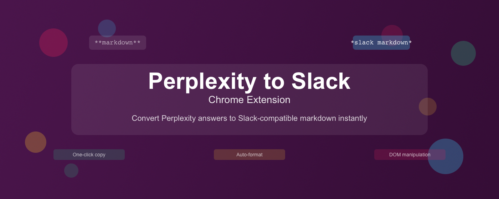
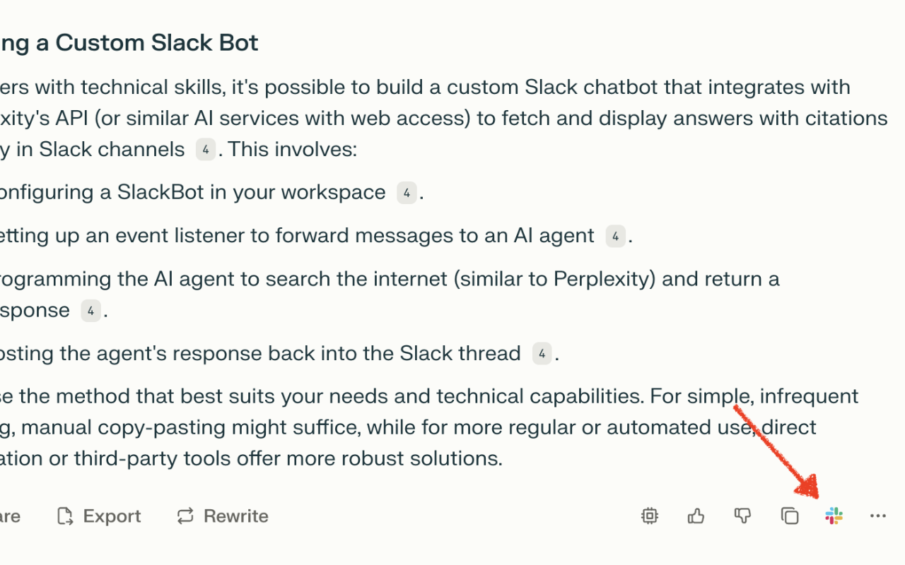
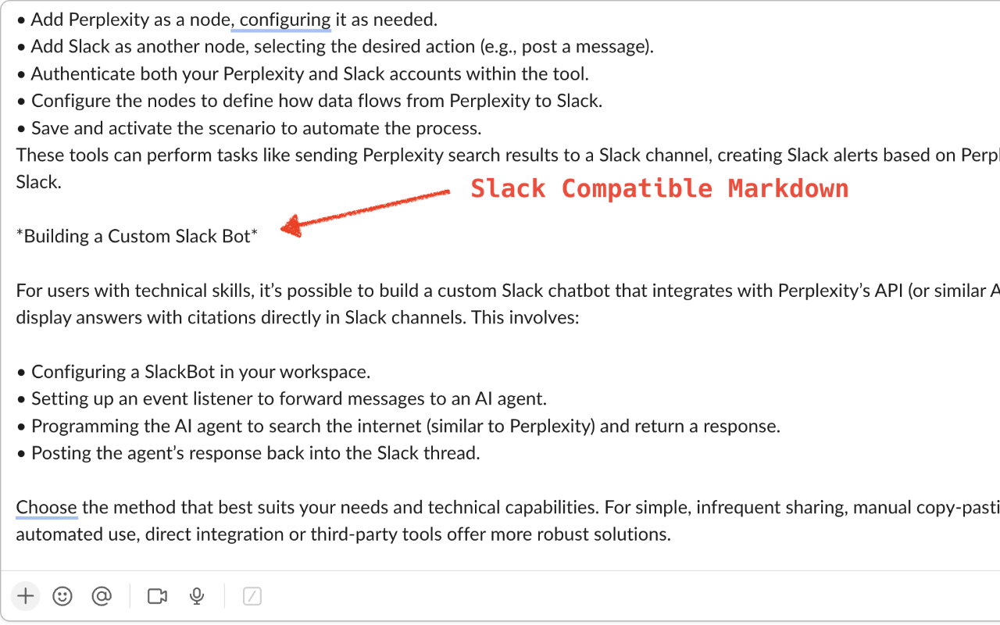

# Perplexity to Slack



A Chrome Extension that adds a "Copy for Slack" button to Perplexity.ai, letting you copy answers in Slack-compatible markdown.

---

## Features

- Adds a Slack-branded copy button to Perplexity.ai answers
- Cleans up citations and formatting for Slack
- Preserves bold, headers, lists, and code blocks
- Copies to clipboard with one click

---

## Installation

### From Source

1. Clone this repository:
   ```bash
   git clone https://github.com/h6y3/perplexity2slack.git
   cd perplexity2slack
   ```
2. Build the extension:
   ```bash
   ./build.sh
   ```
3. In Chrome, go to `chrome://extensions/`, enable "Developer mode", and:
   - Click "Load unpacked" and select the project directory, **or**
   - Drag `dist/perplexity2slack.zip` onto the extensions page

---

## Usage

- Visit [Perplexity.ai](https://www.perplexity.ai)
- Click the Slack button next to any answer to copy it in Slack markdown
- Paste into any Slack chat

---

## Enabling Slack Markdown Formatting

Slack uses its own markdown-like syntax (called "mrkdwn") for formatting messages.
To ensure your pasted content appears correctly:

- **Basic formatting** (bold, italics, lists, links) is enabled by default in all Slack messages.
- **Code blocks:** Use triple backticks (```) before and after your code, or use the code button in the message toolbar.
- **Advanced formatting:**
  - Go to **Preferences > Advanced** in Slack.
  - Make sure "Format messages with markup" is enabled.
- If you paste content and it doesn't look right, try pasting into a new message or check your Slack settings.

For more details, see [Slack's formatting guide](https://slack.com/help/articles/202288908-Format-your-messages).

---

## How it Works

**1. Click the Slack button on Perplexity.ai:**



**2. Paste into Slack for perfectly formatted markdown:**



---

## Development

- Main logic: [`content.js`](content.js)
- Build script: [`build.sh`](build.sh)
- Manual testing: open example HTML files in [`tests/`](tests/) or load the extension in Chrome

Project structure:
```
.
├── manifest.json
├── background.js
├── content.js
├── assets/icons/
├── assets/readme/
├── styles/button.css
└── tests/
```

---

## Contributing

Pull requests welcome.

---

## License

MIT